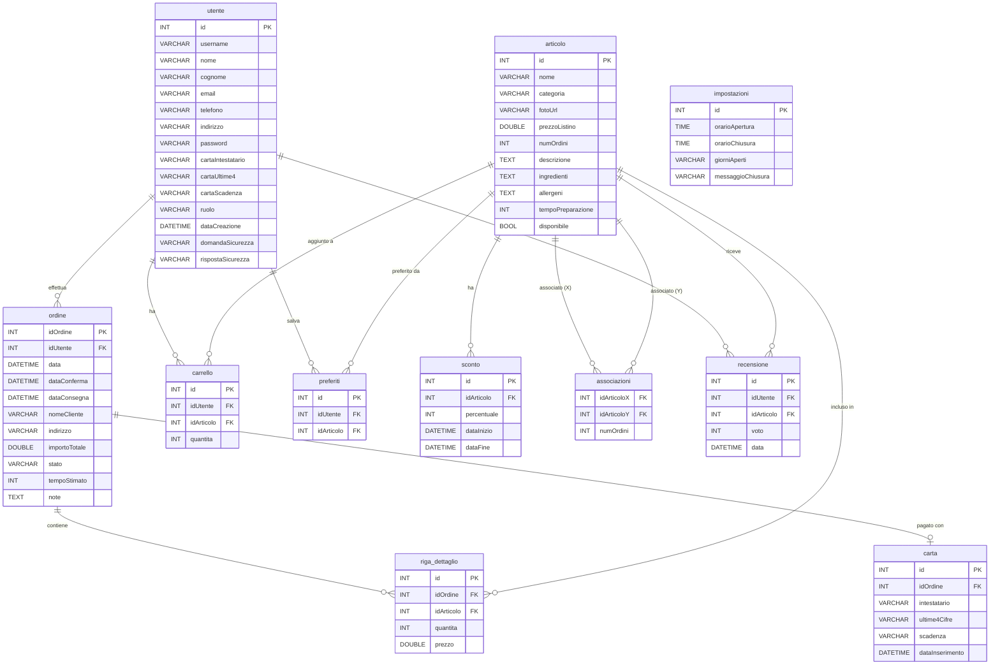

# Entity-Relationship Diagram — Deliveroo Clone

## Relazioni

| Relazione | Cardinalità | Descrizione |
|---|---|---|
| `utente` → `ordine` | 1:N | Un utente può avere più ordini |
| `utente` → `carrello` | 1:N | Un utente ha un carrello con più righe |
| `utente` → `preferiti` | 1:N | Un utente può salvare più articoli preferiti |
| `utente` → `recensione` | 1:N | Un utente può recensire più prodotti |
| `utente.domandaSicurezza` | — | Domanda di sicurezza per il reset password (hash BCrypt sulla risposta) |
| `ordine` → `riga_dettaglio` | 1:N | Un ordine contiene più righe dettaglio |
| `ordine` → `carta` | 1:0..1 | Un ordine può essere associato a una carta |
| `articolo` → `riga_dettaglio` | 1:N | Un articolo può apparire in più ordini |
| `articolo` → `carrello` | 1:N | Un articolo può essere in più carrelli |
| `articolo` → `preferiti` | 1:N | Un articolo può essere salvato da più utenti |
| `articolo` → `sconto` | 1:N | Un articolo può avere più sconti (non sovrapposti) |
| `articolo` → `recensione` | 1:N | Un articolo può ricevere più recensioni |
| `articolo` ↔ `articolo` | M:N | Associazioni tra prodotti (via tabella `associazioni`) |
